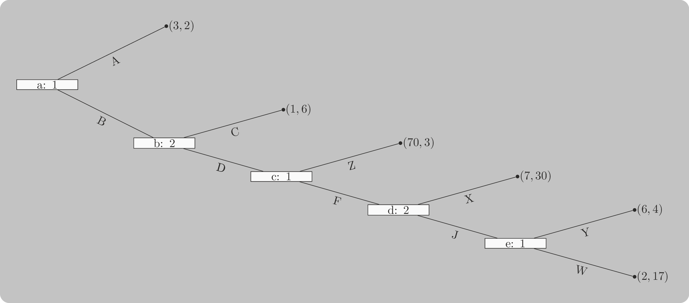
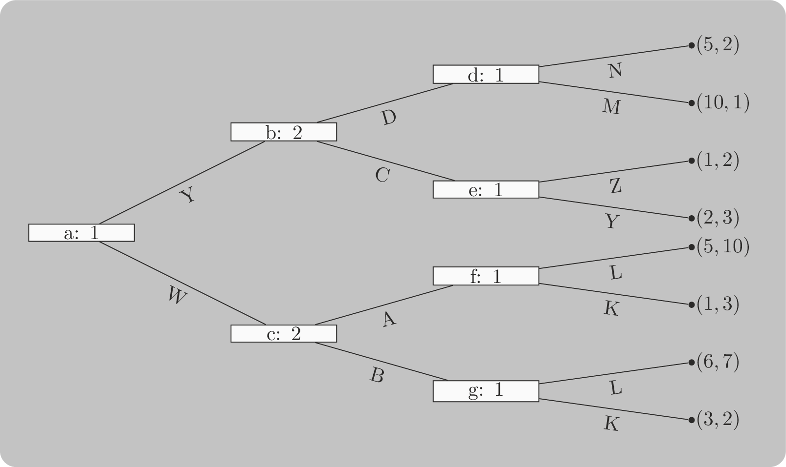
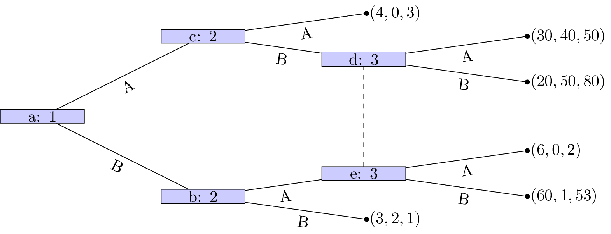
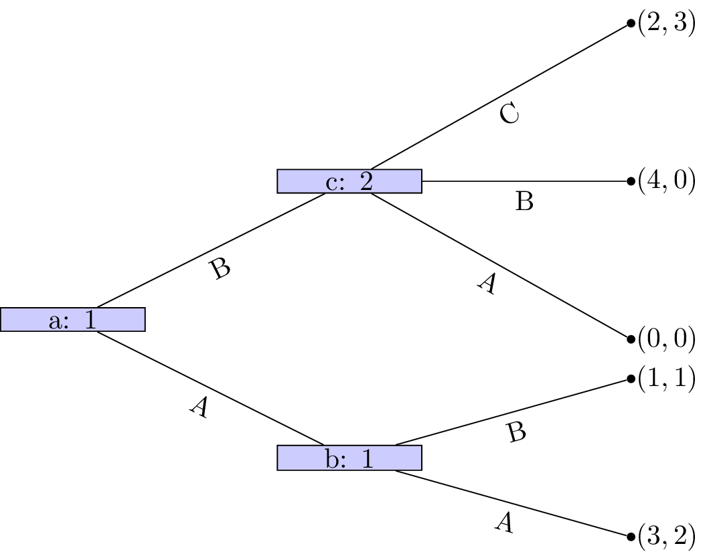
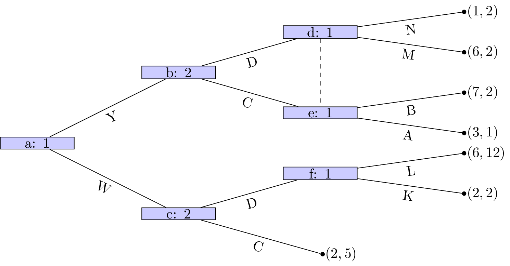
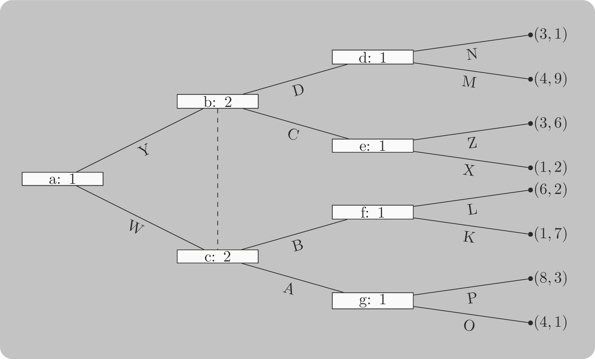
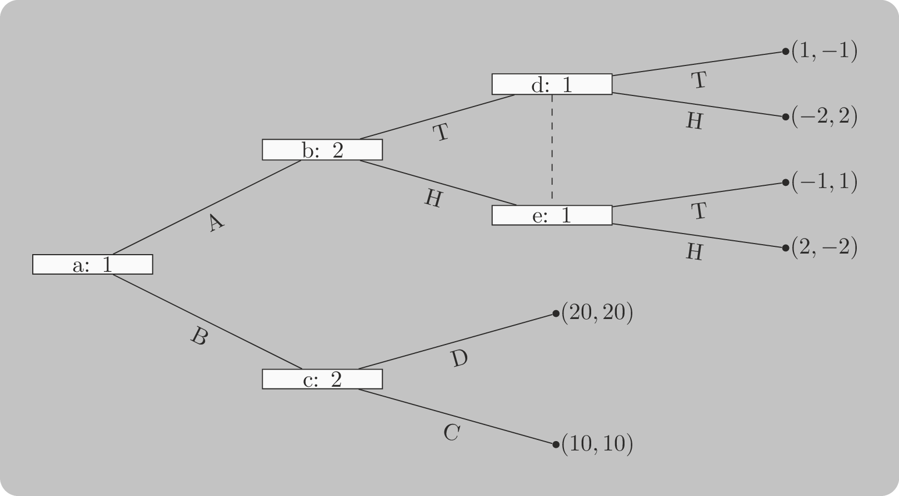

---
kernelspec:
  name: python3
  display_name: "Python 3"
---

(chp:sub_game_perfection)=

# Subgame Perfection

Nash equilibrium can be sustained by off-path promises that would never
actually be honoured. This chapter introduces subgame perfect equilibrium,
which rules out such implausible promises by requiring rationality at every
point in the game tree, not only along the equilibrium path.

(seltens_chain_store_paradox)=

## Motivating Example

We will motivate this chapter using a special case of Selten's Chain Store Paradox [@selten1978chain]
which models an incumbent chain of stores that is well established and an
entrant to the market.

Campus Caffeine, a mobile coffee van, is considering parking near a
university where Latte Lords, a well-established bricks-and-mortar café,
has been operating unchallenged. If Campus Caffeine **enters**, Latte Lords
can slash prices for students (**Fight**) or maintain their premium pricing
(**Accommodate**). If Campus Caffeine stays out (**withdraws**), Latte Lords keeps
enjoying high margins.

There are three outcomes which are shown as an extensive form game in
[](#fig:chain_store_paradox):

- Campus Caffeine chooses to withdraw and does not enter the market: they
  receive a utility of 1 and Latte Lords continues to have a monopoly with which
  corresponds to a utility of 5.
- Campus Caffeine enters the market and Latte Lords competes: this leads to low
  prices that give neither company a profit. They both obtain a utility of 0.
- Campus Caffeine enters and Latte Lords accommodates: they both share the
  market obtaining a utility of 2.

```{figure} ./images/chain-store-paradox/main.png
:alt: An extensive form game with 3 leafs.
:label: fig:chain_store_paradox
:height: 250px

The extensive form game between Campus Caffeine and Latte Lords.
```

As described in the [](#sec:mapping_extensive_form_games_to_normal_form) section it is
possible to map an extensive form game to a normal form game. In this case we
have:

$$
\mathcal{A}_1=\{\text{Accommodate}, \text{Fight}\}
\mathcal{A}_2=\{\text{Enter}, \text{Withdraw}\}\qquad
$$

giving:

$$
M_1=\begin{pmatrix}
2& 5\\
0& 5\\
\end{pmatrix}
\qquad
M_2=\begin{pmatrix}
2& 5\\
0& 1\\
\end{pmatrix}
$$

The incumbent can threaten to fight the entrant however the entrant knows that
this threat if carried out would be harmful to both of them. Thus the threat is
in essence an empty threat: the entrant will enter and the incumbent will use
their best response which is to accommodate.

This is an example of a degenerate game, the Nash equilibria was considered in
[](#exam:support_enumeration_for_a_degenerate_game) showing that there are in
fact 3 of them:

- $((1, 0), (1, 0))$: the entrant enters the market and the incumbent accommodates.
- $((0, 1), (0, 1))$: the entrant withdraws and the incumbent fights.
- $((\frac{3}{4}, \frac{1}{4}), (\frac{1}{4}, \frac{3}{4}))$: a mixture between
  the two.

This chapter will give the mathematical vocabulary to describe the difference
between these equilibria.

## Theory

To identify emergent behaviour in extensive form games we assume that players not only attempt to optimise their
overall utility but optimise their utility conditional on any information set.

(sec:definition_of_sequential_rationality)=

### Definition: Sequential rationality

---

**Sequential rationality:** An optimal strategy for a player should maximise that player's expected payoff,
conditional on every information set at which that player has a decision.

---

With this notion in mind we can now define an analysis technique for extensive form games:

### Definition: Backward induction

---

**Backward induction:** This is the process of analysing a game from back to front.
At each information set we remove strategies that are dominated.

---

#### Example

Let us consider the game shown in [](#fig:backwards-induction-running-example-step-1)

```{figure} ./images/backwards-induction-running-example-step-1/main.png
:alt: Running example for backwards inductions
:label: fig:backwards-induction-running-example-step-1
:height: 250px

An extensive form game that we will use backwards induction on.
```

We see that at node $(d)$ that Z is a dominated action.
So the game reduces as shown in [](#fig:backwards-induction-running-example-step-2).

```{figure} ./images/backwards-induction-running-example-step-2/main.png
:alt: Running example for backwards inductions after removing Z.
:label: fig:backwards-induction-running-example-step-2
:height: 250px

Reducing the game because Z is a dominated action.
```

Player 1s strategy profile is (Y).
At node $(c)$ A is a dominated action so that the game reduces as shown in [](#fig:backwards-induction-running-example-step-3).

```{figure} ./images/backwards-induction-running-example-step-3/main.png
:alt: Running example for backwards inductions after removing A.
:label: fig:backwards-induction-running-example-step-3
:height: 250px

Reducing the game because A is a dominated action.
```

Player 2s strategy profile is (B). At node $(b)$ D is a dominated action so that the game reduces as shown.

```{figure} ./images/backwards-induction-running-example-step-4/main.png
:alt: Running example for backwards inductions after removing D
:label: fig:backwards-induction-running-example-step-4
:height: 250px

Reducing the game because D is a dominated action.
```

Player 2s strategy profile is thus (C,B) and finally strategy W is dominated for player 1 whose strategy profile is (X,Y).
This pair of strategies form a Nash equilibrium.

### Theorem of existence of Nash equilibrium in games of perfect information.

---

Every finite game with perfect information has a Nash equilibrium in pure strategies. Backward induction identifies an equilibrium.

---

**Proof**:

---

Recalling the properties of [sequential rationality](#sec:definition_of_sequential_rationality) we see that no player will
have an incentive to deviate from the strategy profile found through backward induction.
Secondly every finite game with perfect information can be solved using backward induction which gives the result.

---

### Definition: Subgame

---

In an extensive form game, a node $x$ is said to **initiate a subgame** if and only if $x$ and all successors of $x$
are in information sets containing only successors of $x$.

---

#### Example: a game where all nodes initiate subgames

A game where all nodes initiate a subgame is given in [](#fig:game-with-perfect-information).

```{figure} ./images/game-with-perfect-information/main.png
:alt: An extensive form game with perfect information
:label: fig:game-with-perfect-information
:height: 250px

An extensive form game where all nodes initiate a subgame.
```

#### Example: a game where all nodes do not initiate subgames

A game **that does not have perfect information** nodes $c$, $f$ and $b$ initiate subgames but both of $b$'s successors do
not is shown in [](#fig:game-with-imperfect-information)

```{figure} ./images/game-with-imperfect-information/main.png
:alt: An extensive form game with imperfect information
:label: fig:game-with-imperfect-information
:height: 250px

An extensive form game where all nodes do not initiate a subgame.
```

The notion of a subgame leads us to define a specific property of some Nash
equilibrium.

### Definition: Subgame perfect equilibrium

---

A subgame perfect Nash equilibrium is a Nash equilibrium in which the strategy profiles specify Nash
equilibria for every subgame of the game.

---

```{note}
This includes subgames that might not be reached during play.
```

Let us consider the example in [](#fig:game-with-a-subgame-perfect-equilibrium).

```{figure} ./images/game-with-subgame-perfect-equilibrium/main.png
:alt: An extensive form game with a subgame perfect equilibrium
:label: fig:game-with-a-subgame-perfect-equilibrium
:height: 250px

An game with subgame perfect equilibrium.
```

Let us build the corresponding normal form game:

$$A_1=\{AC,AD,BC,BD\}$$
and
$$A_2=\{X,Y\}$$

using the above ordering we have:

$$
M_1=
\begin{pmatrix}
-1&0\\
2&-1\\
1&1\\
1&1
\end{pmatrix}
\qquad
M_2=
\begin{pmatrix}
2&-1\\
3&1\\
7&7\\
7&7
\end{pmatrix}
$$

The Nash equilibria for the above game (found by inspecting best responses in action space) are:

$$\{(AD,X),(BC,Y),(BD,Y)\}$$

If we take a look at the normal form game representation of the subgame initiated at node b with action sets:

$$A_1=\{C,D\}\text{ and }A_2=\{X,Y\}$$

we have:

$$
M_1=
\begin{pmatrix}
-1&0\\
2&-1
\end{pmatrix}
\qquad
M_1=
\begin{pmatrix}
2&-1\\
3&1
\end{pmatrix}
$$

We see that the (unique) Nash equilibria for the above game is $(D,X)$.
Thus the only subgame perfect equilibria of the _entire_ game is $\{AD,X\}$.

```{note}
In games with perfect information, the Nash equilibrium obtained through backwards induction is subgame perfect.
```

## Exercises

```{exercise}
:label: backward_induction_practice

Obtain the Nash equilibrium for the following games using backward induction:

1. 
2. 
3. 
4. 
```

```{exercise}
:label: entry_signals_and_continuous_action

Player 1 chooses a number $x \geq 0$, which Player 2 observes. Then, both
players simultaneously and independently choose real numbers $y_1, y_2 \in
\mathbb{R}$. The utility functions are:

- Player 1: $2y_2y_1 + xy_1 - y_1^2 - \frac{x^3}{3}$
- Player 2: $-(y_1 - 2y_2)^2$

Find the subgame perfect equilibrium of this game.
```

```{exercise}
:label: subgame_identification_and_refinement

For each of the following extensive form games:

1. 
2. 
3. 

- Identify all subgames.
- Derive the corresponding normal form representations.
- Find all Nash equilibria.
- Identify which are subgame perfect.
```

```{exercise}
:label: stackelberg_ice_cream_sellers

Two ice cream sellers choose locations along a beach represented by $[0,1]$.
Customers are uniformly distributed and always go to the nearest seller.

- **Player 1** chooses $x_1 \in [0,1]$
- **Player 2** observes $x_1$, then chooses $x_2 \in [0,1]$

Each seller's payoff is the proportion of customers they serve. Assume:

- If $x_1 = x_2$, each serves 50%.
- If $x_1 < x_2$, Player 1 serves $[0, \frac{x_1 + x_2}{2}]$, and Player 2 the rest.
- If $x_2 < x_1$, the roles reverse.

1. Write the payoff functions of each player.
2. Derive Player 2’s best response function $x_2^*(x_1)$.
3. Use backward induction to find the subgame perfect equilibrium.

> _Hint_: Think geometrically about the midpoint between locations.
```

## Programming

### Using Gambit to study an extensive form game

The `pygambit` library can compute equilibria of extensive form games. We define
Selten’s Chain Store Paradox as follows:

```{code-cell} python3
import pygambit as gbt

g = gbt.Game.new_tree(players=["Incumbent", "Entrant"],
                      title="1 stage Selten's Chain Store Paradox")
g.append_move(g.root, "Entrant", ["Enter", "Withdraw"])
g.append_move(g.root.children[0], "Incumbent", ["Accomodate", "Fight"])
g.set_outcome(g.root.children[1], g.add_outcome([5, 1], label="No entry"))
g.set_outcome(g.root.children[0].children[0], g.add_outcome([2, 2], label="Shared Market"))
g.set_outcome(g.root.children[0].children[1], g.add_outcome([0, 0], label="Competition"))
print(g)
```

This creates the extensive form game. To convert it to a normal form:

```{code-cell} python3
print(f"Normal form payoff matrices: {g.to_arrays(dtype=float)}")
```

```{note}
We use `dtype=float` so that results are returned in floating-point instead
of exact rational arithmetic.
```

To compute the pure-strategy Nash equilibria:

```{code-cell} python3
result = gbt.nash.enumpure_solve(g)
print(f"Pure-strategy Nash equilibria: {result.equilibria}")
```

## Notable Research

The concept of subgame perfection was first introduced in
[@selten1965spieltheoretische] and later reformulated in English in
[@selten1988reexamination], both by Reinhard Selten. The motivating example for
this chapter, the Chain Store Paradox, appears in [@selten1978chain], where Selten
considers multiple sequential market entrants and examines the credibility of
entry-deterrence strategies.

The framework was extended in [@milgrom1982predation], which introduced
**asymmetric information** and **reputation effects**. These additions showed how
players might sustain seemingly irrational threats (such as fighting entry) by
considering the beliefs and inferences of future opponents.

The idea of subgame perfection was further refined in [@kreps1982sequential],
which introduced the concept of **sequential equilibrium**, and in
[@grossman1986perfect], which developed **perfect sequential equilibrium**. These
refinements allow for the analysis of games where off-equilibrium beliefs matter,
providing stronger predictions in extensive form games with imperfect information.

## Conclusion

Subgame perfection refines the concept of Nash equilibrium by requiring that
players' strategies form a Nash equilibrium not just in the game as a whole, but
in every subgame, including those off the equilibrium path. This refinement
eliminates non-credible threats and ensures sequential rationality at every
decision point. Table [](#tbl:spe_summary) summaries the main concepts of this
chapter.

```{table} The main concepts for Subgame Perfectoin
:label: tbl:spe_summary
:align: center
:class: table-bordered

| Concept                     | Description                                                            |
| --------------------------- | ---------------------------------------------------------------------- |
| Sequential rationality      | Players optimise at each information set                               |
| Backward induction          | Method to compute subgame perfect equilibria in perfect information    |
| Subgame                     | Portion of a game starting at a decision node and fully self-contained |
| Subgame perfect equilibrium | A strategy profile that is a Nash equilibrium in every subgame         |

```

We illustrated these ideas with [Selten’s Chain Store Paradox](#seltens_chain_store_paradox), which highlights
how subgame perfection rules out the incumbent’s non-credible threat to fight.

---

```{attention}
In games with perfect information, backward induction not only
gives a Nash equilibrium; it guarantees a subgame perfect one.
```

---

(solutions:subgame_perfection)=

## Solutions

```{solution} backward_induction_practice
:label: solution:backward_induction_practice

**Game 1.**

Starting at the deepest node, node $e$ (Player 1): $Y$ gives payoff $6 > 2$, so
Player 1 chooses $Y$, replacing node $e$ with $(6, 4)$.

At node $d$ (Player 2): $X$ gives payoff $30 > 4$, so Player 2 chooses $X$,
replacing node $d$ with $(7, 30)$.

At node $c$ (Player 1): $Z$ gives payoff $70 > 7$, so Player 1 chooses $Z$,
replacing node $c$ with $(70, 3)$.

At node $b$ (Player 2): $C$ gives payoff $6 > 3$, so Player 2 chooses $C$,
replacing node $b$ with $(1, 6)$.

At node $a$ (Player 1): $A$ gives payoff $3 > 1$, so Player 1 chooses $A$.

The Nash equilibrium is $(\mathbf{AZY}, \mathbf{CX})$ with outcome $(3, 2)$.

---

**Game 2.**

At node $d$ (Player 1): $M$ gives $10 > 5$, so Player 1 chooses $M$,
replacing node $d$ with $(10, 1)$.

At node $e$ (Player 1): $Y$ gives $2 > 1$, so Player 1 chooses $Y$,
replacing node $e$ with $(2, 3)$.

At node $f$ (Player 1): $L$ gives $5 > 1$, so Player 1 chooses $L$,
replacing node $f$ with $(5, 10)$.

At node $g$ (Player 1): $L$ gives $6 > 3$, so Player 1 chooses $L$,
replacing node $g$ with $(6, 7)$.

At node $b$ (Player 2): $C$ gives $3 > 1$, so Player 2 chooses $C$,
replacing node $b$ with $(2, 3)$.

At node $c$ (Player 2): $A$ gives $10 > 7$, so Player 2 chooses $A$,
replacing node $c$ with $(5, 10)$.

At node $a$ (Player 1): $W$ gives $5 > 2$, so Player 1 chooses $W$.

The Nash equilibrium is $(\mathbf{WMYLL}, \mathbf{AC})$ with outcome $(5, 10)$.

---

**Game 3.**

This game has imperfect information: Player 2's nodes $b$ and $c$ form one
information set, and Player 3's nodes $d$ and $e$ form another. Backward
induction is applied by identifying dominant actions at each information set.

At Player 3's information set $\{d, e\}$: at node $d$, action $B$ gives
$80 > 50$; at node $e$, action $B$ gives $53 > 2$. So $B$ dominates $A$ for
Player 3 at both nodes.

With Player 3 playing $B$, node $d$ is replaced by $(20, 50, 80)$ and node $e$
by $(60, 1, 53)$.

At Player 2's information set $\{b, c\}$: at node $b$, action $B$ gives
$2 > 1$ (leading to $(3,2,1)$ vs $(60,1,53)$); at node $c$, action $B$ gives
$50 > 0$ (leading to $(20,50,80)$ vs $(4,0,3)$). So $B$ dominates $A$ for
Player 2 at both nodes.

With Player 2 playing $B$: node $b$ is replaced by $(3, 2, 1)$ and node $c$
by $(20, 50, 80)$.

At node $a$ (Player 1): $A$ gives $20 > 3$, so Player 1 chooses $A$.

The Nash equilibrium is $(\mathbf{A}, \mathbf{B}, \mathbf{B})$ with outcome
$(20, 50, 80)$.

---

**Game 4.**

At node $b$ (Player 1): $A$ gives $3 > 1$, so Player 1 chooses $A$,
replacing node $b$ with $(3, 2)$.

At node $c$ (Player 2): $C$ gives $3 > 0 = 0$, so Player 2 chooses $C$,
replacing node $c$ with $(2, 3)$.

At node $a$ (Player 1): $A$ gives $3 > 2$, so Player 1 chooses $A$.

The Nash equilibrium is $(\mathbf{AA}, \mathbf{C})$ with outcome $(3, 2)$.

```

````{solution} entry_signals_and_continuous_action
:label: solution:entry_signals_and_continuous_action

We solve by backward induction. Player 1 moves first (choosing $x \geq 0$),
then both players simultaneously choose $y_1, y_2 \in \mathbb{R}$.

**Step 1: Solve the simultaneous subgame for fixed $x$.**

Player 2 maximises $-(y_1 - 2y_2)^2$, which requires $y_1 - 2y_2 = 0$, giving:

$$
\tilde{y}_2(y_1) = \frac{y_1}{2}
$$

Player 1 maximises $2y_2 y_1 + xy_1 - y_1^2 - x^3/3$ over $y_1$. The
first-order condition is:

$$
\frac{\partial u_1}{\partial y_1} = 2y_2 + x - 2y_1 = 0
\implies \tilde{y}_1(y_2) = \frac{2y_2 + x}{2}
$$

Solving the two best responses simultaneously by substituting
$\tilde{y}_2 = y_1/2$ into $\tilde{y}_1$:

$$
y_1 = \frac{2(y_1/2) + x}{2} = \frac{y_1 + x}{2}
\implies y_1 = x, \qquad y_2 = \frac{x}{2}
$$

**Step 2: Optimise Player 1's choice of $x$.**

Substituting $y_1 = x$ and $y_2 = x/2$ into $u_1$:

$$
u_1 = 2 \cdot \frac{x}{2} \cdot x + x \cdot x - x^2 - \frac{x^3}{3} = x^2 - \frac{x^3}{3}
$$

The first-order condition $\frac{du_1}{dx} = 2x - x^2 = x(2-x) = 0$ gives
$x = 0$ or $x = 2$. The second-order condition
$\frac{d^2u_1}{dx^2} = 2 - 2x$ equals $-2 < 0$ at $x = 2$ (maximum) and
$2 > 0$ at $x = 0$ (minimum), so $x^* = 2$.

**Subgame perfect equilibrium:**

$$
(x^*,\ \tilde{y}_1(x),\ \tilde{y}_2(y_1)) = \left(2,\ x,\ \frac{y_1}{2}\right)
$$

On the equilibrium path: $x^* = 2$, $y_1^* = 2$, $y_2^* = 1$.

Here is some code to verify these calculations:

```{code-cell} python3
import sympy as sym

x, y1, y2 = sym.symbols("x y1 y2", real=True)

u1 = 2 * y2 * y1 + x * y1 - y1**2 - sym.Rational(1, 3) * x**3
u2 = -(y1 - 2 * y2)**2

br2 = sym.solve(sym.diff(u2, y2), y2)[0]
br1 = sym.solve(sym.diff(u1, y1), y1)[0]
print("Player 2 BR:", br2)
print("Player 1 BR:", br1)

y1_eq = sym.solve(sym.Eq(y1, br1.subs(y2, br2)), y1)[0]
y2_eq = br2.subs(y1, y1_eq)
print("Simultaneous solution: y1 =", y1_eq, ", y2 =", y2_eq)

u1_reduced = u1.subs([(y1, y1_eq), (y2, y2_eq)])
x_star = sym.solve(sym.diff(u1_reduced, x), x)
print("Optimal x candidates:", x_star)
```
````

```{solution} subgame_identification_and_refinement
:label: solution:subgame_identification_and_refinement

**Game 1.** Nodes $d$ and $e$ are in the same information set, but $d$ has
action set $\{M, N\}$ while $e$ has action set $\{A, B\}$. This violates the
requirement that all nodes in an information set share the same action set.
The game is not well-defined.

**Game 2.** Nodes $b$ and $c$ are in the same information set, but $b$ has
action set $\{C, D\}$ while $c$ has action set $\{A, B\}$. The game is not
well-defined for the same reason.

**Game 3.**

**Subgames.** Node $c$ is a singleton and all its successors are terminals, so
it initiates a subgame. Node $b$ is a singleton and its only non-terminal
successors, $d$ and $e$, are both in the same information set $\{d,e\}$, which
lies entirely within the subtree of $b$; so $b$ also initiates a subgame.

**Subgame at $c$.** Player 2 chooses $C \to (10, 10)$ or $D \to (20, 20)$.
Since $20 > 10$, Player 2 plays $D$.

**Subgame at $b$.** Player 2 chooses $H$ (reaching node $e$) or $T$ (reaching
node $d$). Player 1, unable to distinguish $d$ from $e$, plays a single action
from $\{H, T\}$ at the information set. With rows as Player 2's actions at $b$
and columns as Player 1's actions at $\{d,e\}$:

$$
M_r = \begin{pmatrix} -2 & 1 \\ 2 & -1 \end{pmatrix}
\qquad
M_c = \begin{pmatrix} 2 & -1 \\ -2 & 1 \end{pmatrix}
$$ There is no pure Nash equilibrium. For the mixed equilibrium, Player
1's indifference condition gives:

$$
-2q + 2(1-q) = 2q - 2(1-q) \implies q = \tfrac{1}{2}
$$

and Player 2's indifference condition gives:

$$
2p - (1-p) = -2p + (1-p) \implies p = \tfrac{1}{3}
$$

The unique Nash equilibrium of this subgame is Player 2 plays $H$ with
probability $\tfrac{1}{2}$ and Player 1 plays $H$ with probability $\tfrac{1}{3}$.
Player 1's expected payoff at this equilibrium is $0$.

**Normal form of the whole game.** The strategy sets are:

$$
S_1 = \{AH,\ AT,\ BH,\ BT\}, \qquad S_2 = \{HC,\ HD,\ TC,\ TD\}
$$

where the first letter of each strategy is the action at $a$ (for Player 1) or
$b$ (for Player 2), and the second is the action at $\{d,e\}$ (for Player 1)
or $c$ (for Player 2). With rows ordered $(AH, AT, BH, BT)$ and columns
ordered $(HC, HD, TC, TD)$:

$$
M_r = \begin{pmatrix}
2  &  2  & -2 & -2 \\
-1 & -1  &  1 &  1 \\
10 & 20  & 10 & 20 \\
10 & 20  & 10 & 20
\end{pmatrix}
\qquad
M_c = \begin{pmatrix}
-2 & -2 &  2 &  2 \\
 1 &  1 & -1 & -1 \\
10 & 20 & 10 & 20 \\
10 & 20 & 10 & 20
\end{pmatrix}
$$

**Pure Nash equilibria.** For any Player 2 strategy, Player 1 prefers $BH$ or
$BT$ (payoff 10 or 20) over any $A$-strategy. Given Player 1 plays $B$, Player
2 prefers $D$ at $c$ (payoff 20 over 10). There are four pure Nash equilibria:
$(BH, HD)$, $(BH, TD)$, $(BT, HD)$, $(BT, TD)$.

**Subgame perfection.** Each pure Nash equilibrium fixes a pure strategy for
Player 2 at $b$ and Player 1 at $\{d,e\}$; none of these pure combinations are
Nash equilibria in the subgame at $b$ (which has no pure Nash equilibrium), so
none of the four pure equilibria are subgame perfect.

The unique subgame perfect Nash equilibrium combines the mixed Nash equilibrium
of the subgame at $b$ with Player 1 choosing $B$ at $a$ (expected payoff $20 >
0$) and Player 2 choosing $D$ at $c$:

$$
\sigma_1 = (AH: 0,\ AT: 0,\ BH: \tfrac{1}{3},\ BT: \tfrac{2}{3})
$$

$$
\sigma_2 = (HC: 0,\ HD: \tfrac{1}{2},\ TC: 0,\ TD: \tfrac{1}{2})
$$

```

```{solution} stackelberg_ice_cream_sellers
:label: solution:stackelberg_ice_cream_sellers

**1. Payoff functions**

Players choose locations $x_1, x_2 \in [0, 1]$. Customers are uniformly
distributed and travel to the nearest seller. When $x_1 < x_2$:

- Player 1 serves customers in $\left[0,\; \frac{x_1+x_2}{2}\right]$, a fraction
  $\frac{x_1+x_2}{2}$ of the total.
- Player 2 serves customers in $\left[\frac{x_1+x_2}{2},\; 1\right]$, a fraction
  $1 - \frac{x_1+x_2}{2}$.

When $x_1 = x_2$, each gets $\frac{1}{2}$. By symmetry, when $x_2 < x_1$, the
roles reverse. Formally:

$$
u_1(x_1, x_2) =
\begin{cases}
\dfrac{x_1 + x_2}{2} & \text{if } x_1 \leq x_2 \\[6pt]
1 - \dfrac{x_1 + x_2}{2} & \text{if } x_1 > x_2
\end{cases}
$$

$$
u_2(x_1, x_2) = 1 - u_1(x_1, x_2)
$$

**2. Player 2's best response function**

Player 2 observes $x_1$ and chooses $x_2$ to maximise their share. We consider
cases:

- If Player 2 sets $x_2 > x_1$: their payoff is $1 - \frac{x_1+x_2}{2}$, which
  is decreasing in $x_2$. So Player 2 wants $x_2$ as small as possible, i.e.,
  just above $x_1$.

- If Player 2 sets $x_2 < x_1$: their payoff is $\frac{x_1+x_2}{2}$, increasing
  in $x_2$. So Player 2 wants $x_2$ as large as possible, i.e., just below
  $x_1$.

Both cases push $x_2$ towards $x_1$. The limit gives $x_2^* = x_1$, at which
both players share the market equally: $u_2 = \frac{1}{2}$.

More precisely, for any $x_1 \in [0, 1]$, Player 2 cannot do strictly better
than $\frac{1}{2}$ by any deviation from $x_2 = x_1$, since:

- Any $x_2 \neq x_1$ results in the "outside" player serving a region of length
  $< \frac{1}{2}$ or the "inside" player having to share a midpoint that is
  skewed.

The formal best response is:

$$
x_2^*(x_1) = x_1
$$

(any $x_2 = x_1$ yields $u_2 = \frac{1}{2}$; deviation reduces their share).

**3. Subgame perfect equilibrium via backward induction**

Player 1 anticipates Player 2 will set $x_2^* = x_1$, giving $u_1 = \frac{1}{2}$
for any $x_1 \in [0, 1]$.

Since Player 1's payoff is $\frac{1}{2}$ regardless of $x_1$, any $x_1 \in [0,1]$
is a best response. In particular, $x_1^* = \frac{1}{2}$ (centre) supports a
subgame perfect equilibrium:

$$
x_1^* = \tfrac{1}{2},\quad x_2^*(x_1) = x_1
$$

Both players locate at the centre and share the market equally, each earning
$\frac{1}{2}$.
```
