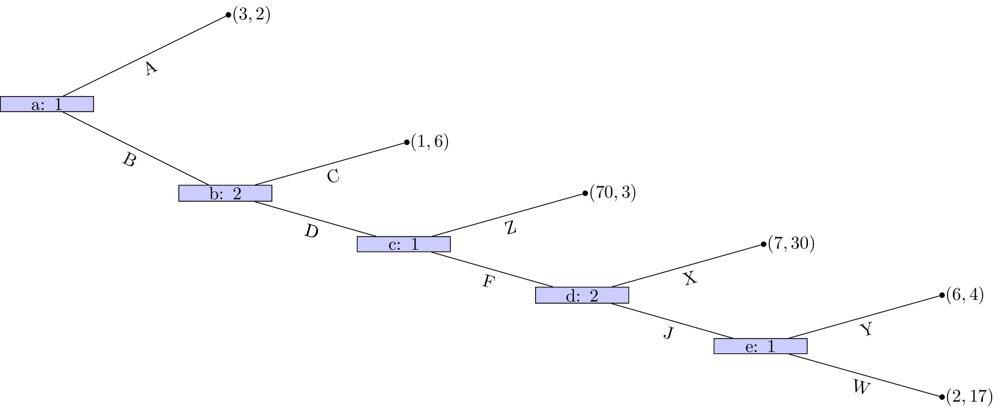
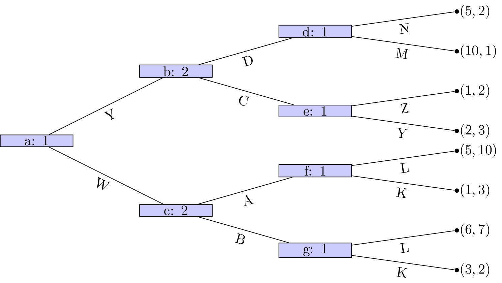
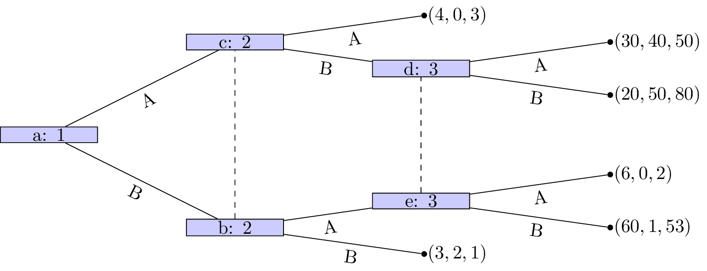
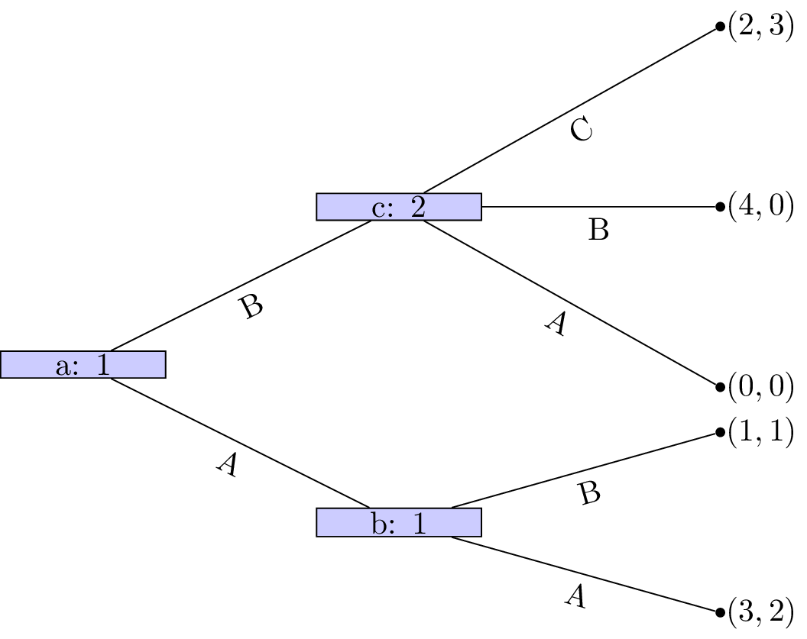
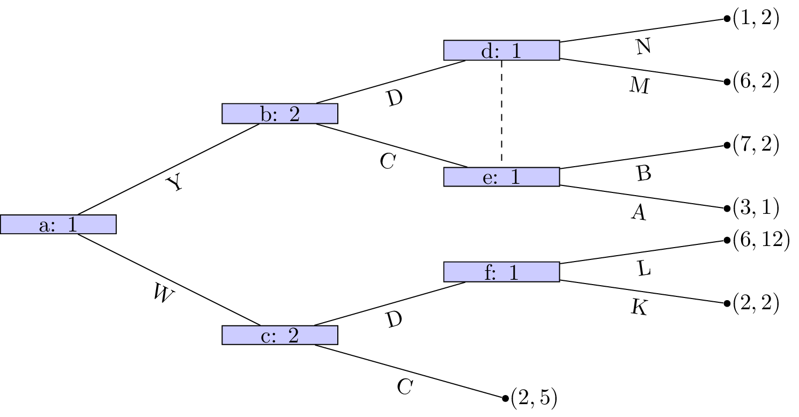
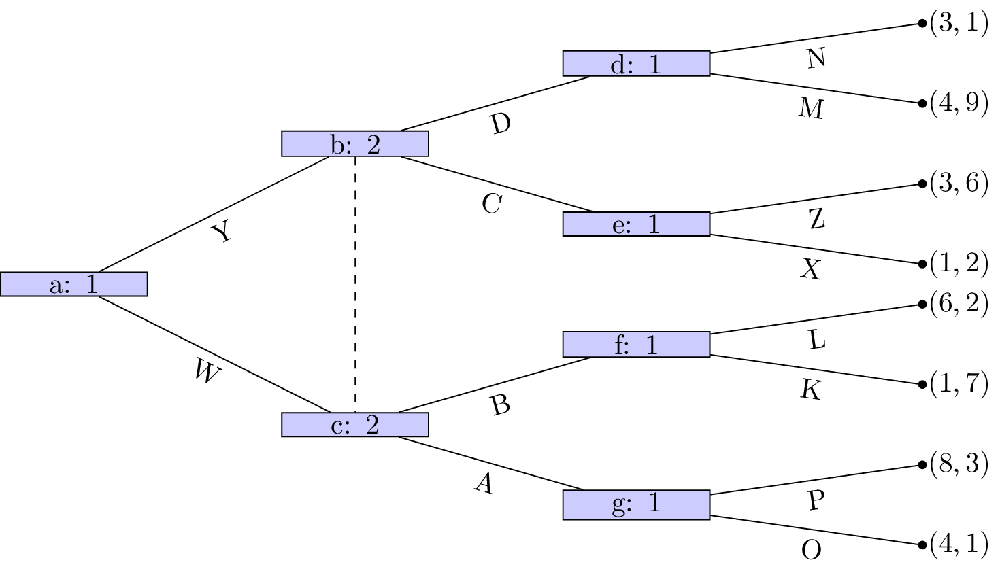
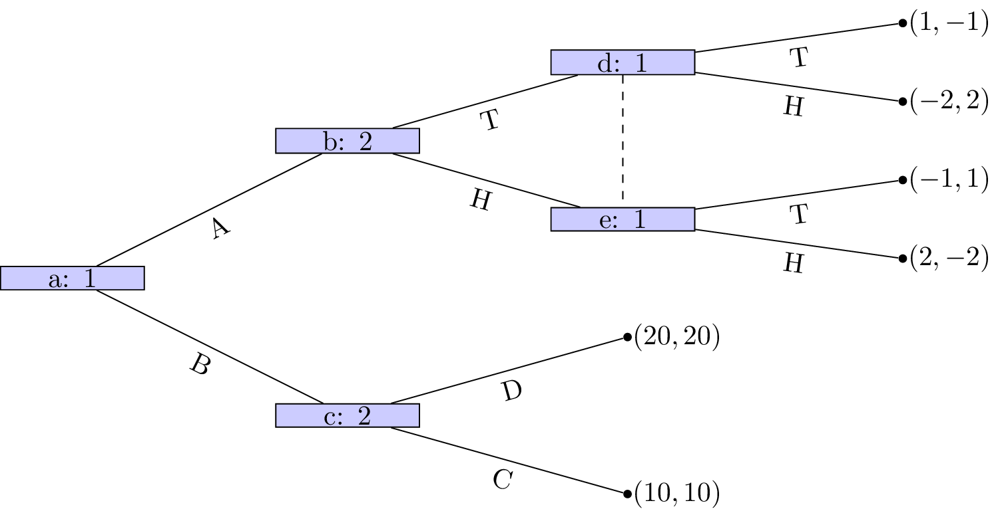

---
kernelspec:
  name: python3
  display_name: "Python 3"
---

(chp:sub_game_perfection)=

# Subgame Perfection

(seltens_chain_store_paradox)=

## Motivating Example

We will motivate this chapter using a special case of Selten's Chain Store Paradox [@selten1978chain]
which models an incumbent chain of stores that is well established and an
entrant to the market.

Campus Caffeine, a mobile coffee van, is considering parking near a
university where Latte Lords, a well-established bricks-and-mortar café,
has been operating unchallenged. If Campus Caffeine **enters**, Latte Lords
can slash prices for students (**Fight**) or maintain their premium pricing
(Accommodate). If Campus Caffeine stays out, Latte Lords keeps
enjoying high margins.

There are three outcomes which are shown as an extensive form game in
[](#fig:chain_store_paradox):

- Campus Caffeine chooses to withdraw and does not enter the market: they
  receive a utility of 1 and Latte Lords continues to have a monopoly with which
  corresponds to a utility of 5.
- Campus Caffeine enters the market and Latte Lords competes: this leads to low
  prices that give neither company a profit. They both obtain a utility of 0.
- Campus Caffeine enters and Latte Lords accommodates: they both share the
  market obtaining a utility of 2.

```{figure} ./images/chain-store-paradox/main.png
:alt: An extensive form game with 3 leafs.
:label: fig:chain_store_paradox
:height: 250px

The extensive form game between Campus Caffeine and Latte Lords.
```

As described in [](#sec:mapping_extensive_form_games_to_normal_form) it is
possible to map an extensive form game to a normal form game. In this case we
have:

$$
\mathcal{A}_1=\{\text{Accommodate}, \text{Fight}\}
\mathcal{A}_2=\{\text{Enter}, \text{Withdraw}\}\qquad
$$

giving:

$$
M_1=\begin{pmatrix}
2& 5\\
0& 5\\
\end{pmatrix}
\qquad
M_2=\begin{pmatrix}
2& 5\\
0& 1\\
\end{pmatrix}
$$

The incumbent can threaten to fight the entrant however the entrant knows that
this threat if carried out would be harmful to both of them. Thus the threat is
in essence an empty threat: the entrant will enter and the incumbent will use
their best response which is to accommodate.

This is an example of a degenerate game, the Nash equilibria was considered in
[](#exam:support_enumeration_for_a_degenerate_game) showing that there are in
fact 3 of them:

- $((1, 0), (1, 0))$: the entrant enters the market and the incumbent accommodates.
- $((0, 1), (0, 1))$: the entrant withdraws and the incumbent fights.
- $((\frac{3}{4}, \frac{1}{4}), (\frac{1}{4}, \frac{3}{4}))$: a mixture between
  the two.

This chapter will give the mathematical vocabulary to describe the difference
between these equilibria.

## Theory

To identify emergent behaviour in extensive form games we assume that players not only attempt to optimize their
overall utility but optimize their utility conditional on any information set.

(sec:definition_of_sequential_rationality)=

### Definition: Sequential rationality

---

**Sequential rationality:** An optimal strategy for a player should maximise that player's expected payoff,
conditional on every information set at which that player has a decision.

---

With this notion in mind we can now define an analysis technique for extensive form games:

### Definition: Backward induction

---

**Backward induction:** This is the process of analysing a game from back to front.
At each information set we remove strategies that are dominated.

---

### Example

Let us consider the game shown in [](#fig:backwards-induction-running-example-step-1)

```{figure} ./images/backwards-induction-running-example-step-1/main.png
:alt: Running example for backwards inductions
:label: fig:backwards-induction-running-example-step-1
:height: 250px

An extensive form game that we will use backwards induction on.
```

We see that at node $(d)$ that Z is a dominated action.
So the game reduces as shown in [](#fig:backwards-induction-running-example-step-2).

```{figure} ./images/backwards-induction-running-example-step-2/main.png
:alt: Running example for backwards inductions after removing Z.
:label: fig:backwards-induction-running-example-step-2
:height: 250px

Reducing the game because Z is a dominated action.
```

Player 1s strategy profile is (Y).
At node $(c)$ A is a dominated action so that the game reduces as shown in [](#fig:backwards-induction-running-example-step-3).

```{figure} ./images/backwards-induction-running-example-step-3/main.png
:alt: Running example for backwards inductions after removing A.
:label: fig:backwards-induction-running-example-step-3
:height: 250px

Reducing the game because A is a dominated action.
```

Player 2s strategy profile is (B). At node $(b)$ D is a dominated action so that the game reduces as shown.

```{figure} ./images/backwards-induction-running-example-step-4/main.png
:alt: Running example for backwards inductions after removing D
:label: fig:backwards-induction-running-example-step-4
:height: 250px

Reducing the game because D is a dominated action.
```

Player 2s strategy profile is thus (C,B) and finally strategy W is dominated for player 1 whose strategy profile is (X,Y).
This pair of strategies form a Nash equilibrium.

### Theorem of existence of Nash equilibrium in games of perfect information.

---

Every finite game with perfect information has a Nash equilibrium in pure strategies. Backward induction identifies an equilibrium.

---

**Proof**:

---

Recalling the properties of [sequential rationality](#sec:definition_of_sequential_rationality) we see that no player will
have an incentive to deviate from the strategy profile found through backward induction.
Secondly every finite game with perfect information can be solved using backward inductions which gives the result.

---

### Definition: Subgame

---

In an extensive form game, a node $x$ is said to **initiate a subgame** if and only if $x$ and all successors of $x$
are in information sets containing only successors of $x$.

---

### Example: a game where all nodes initiate subgames

A game where all nodes initiate a subgame is given in [](#fig:game-with-perfect-information).

```{figure} ./images/game-with-perfect-information/main.png
:alt: An extensive form game with perfect information
:label: fig:game-with-perfect-information
:height: 250px

An extensive form game where all nodes initiate a subgame.
```

### Example: a game where all nodes do not initiate subgames

A game **that does not have perfect information** nodes $c$, $f$ and $b$ initiate subgames but all of $b$'s successors do
not is shown in [](#fig:game-with-imperfect-information)

```{figure} ./images/game-with-imperfect-information/main.png
:alt: An extensive form game with imperfect information
:label: fig:game-with-imperfect-information
:height: 250px

An extensive form game where all nodes do not initiate a subgame.
```

The notion of a subgame leads us to define a specific property of some Nash
equilibrium.

### Definition: Subgame perfect equilibrium

---

A subgame perfect Nash equilibrium is a Nash equilibrium in which the strategy profiles specify Nash
equilibria for every subgame of the game.

---

```{note}
This includes subgames that might not be reached during play.
```

Let us consider the example in [](#fig:game-with-a-subgame-perfect-equilibrium).

```{figure} ./images/game-with-subgame-perfect-equilibrium/main.png
:alt: An extensive form game with a subgame perfect equilibrium
:label: fig:game-with-a-subgame-perfect-equilibrium
:height: 250px

An game with subgame perfect equilibrium.
```

Let us build the corresponding normal form game:

$$A_1=\{AC,AD,BC,BD\}$$
and
$$A_2=\{X,Y\}$$

using the above ordering we have:

$$
M_1=
\begin{pmatrix}
-1&0\\
2&-1\\
1&1\\
1&1
\end{pmatrix}
\qquad
M_2=
\begin{pmatrix}
2&-1\\
3&1\\
7&7\\
7&7
\end{pmatrix}
$$

The Nash equilibria for the above game (found by inspecting best responses in action space) are:

$$\{(AD,X),(BC,Y),(BD,Y)\}$$

If we take a look at the normal form game representation of the subgame initiated at node b with action sets:

$$A_1=\{C,D\}\text{ and }A_2=\{X,Y\}$$

we have:

$$
M_1=
\begin{pmatrix}
-1&0\\
2&-1
\end{pmatrix}
\qquad
M_1=
\begin{pmatrix}
2&-1\\
3&1
\end{pmatrix}
$$

We see that the (unique) Nash equilibria for the above game is $(D,X)$.
Thus the only subgame perfect equilibria of the _entire_ game is $\{AD,X\}$.

```{note}
n games with perfect information, the Nash equilibrium obtained through backwards induction is subgame perfect.
```

## Exercises

### Exercise: Backward induction practice

Obtain the Nash equilibrium for the following games using backward induction:

1. 
2. 
3. 
4. 

---

### Exercise: Entry, signals, and continuous action

Player 1 chooses a number $x \geq 0$, which Player 2 observes. Then, both
players simultaneously and independently choose real numbers $y_1, y_2 \in
\mathbb{R}$. The utility functions are:

- Player 1: $2y_2y_1 + xy_1 - y_1^2 - \frac{x^3}{3}$
- Player 2: $-(y_1 - 2y_2)^2$

Find the subgame perfect equilibrium of this game.

---

### Exercise: Subgame identification and refinement

For each of the following extensive form games:

1. 
2. 
3. 

- Identify all subgames.
- Derive the corresponding normal form representations.
- Find all Nash equilibria.
- Identify which are subgame perfect.

---

### Exercise: Stackelberg ice cream sellers

Two ice cream sellers choose locations along a beach represented by $[0,1]$.
Customers are uniformly distributed and always go to the nearest seller.

- **Player 1** chooses $x_1 \in [0,1]$
- **Player 2** observes $x_1$, then chooses $x_2 \in [0,1]$

Each seller's payoff is the proportion of customers they serve. Assume:

- If $x_1 = x_2$, each serves 50%.
- If $x_1 < x_2$, Player 1 serves $[0, \frac{x_1 + x_2}{2}]$, and Player 2 the rest.
- If $x_2 < x_1$, the roles reverse.

**Tasks:**

1. Write the payoff functions of each player.
2. Derive Player 2’s best response function $x_2^*(x_1)$.
3. Use backward induction to find the subgame perfect equilibrium.
4. Compare this to the simultaneous move version of the game.

> _Hint_: Think geometrically about the midpoint between locations.

---

## Programming

### Using Gambit to study an extensive form game

The `pygambit` library can compute equilibria of extensive form games. We define
Selten’s Chain Store Paradox as follows:

```{code-cell} python3
import pygambit as gbt

g = gbt.Game.new_tree(players=["Incumbent", "Entrant"],
                      title="1 stage Selten's Chain Store Paradox")
g.append_move(g.root, "Entrant", ["Enter", "Withdraw"])
g.append_move(g.root.children[0], "Incumbent", ["Accomodate", "Fight"])
g.set_outcome(g.root.children[1], g.add_outcome([5, 1], label="No entry"))
g.set_outcome(g.root.children[0].children[0], g.add_outcome([2, 2], label="Shared Market"))
g.set_outcome(g.root.children[0].children[1], g.add_outcome([0, 0], label="Competition"))
g
```

This creates the extensive form game. To convert it to a normal form:

```{code-cell} python3
g.to_arrays(dtype=float)
```

```{note}
We use `dtype=float` so that results are returned in floating-point instead
of exact rational arithmetic.
```

To compute the pure-strategy Nash equilibria:

```{code-cell} python3
result = gbt.nash.enumpure_solve(g)
result.equilibria
```

## Conclusion

Subgame perfection refines the concept of Nash equilibrium by requiring that
players' strategies form a Nash equilibrium not just in the game as a whole, but
in every subgame—including those off the equilibrium path. This refinement
eliminates non-credible threats and ensures sequential rationality at every
decision point. Table [](#tbl:spe_summary) summaries the main concepts of this
chapter.

```{table} The main concepts for Subgame Perfectoin
:label: tbl:spe_summary
:align: center
:class: table-bordered

| Concept                     | Description                                                            |
| --------------------------- | ---------------------------------------------------------------------- |
| Sequential rationality      | Players optimise at each information set                               |
| Backward induction          | Method to compute subgame perfect equilibria in perfect information    |
| Subgame                     | Portion of a game starting at a decision node and fully self-contained |
| Subgame perfect equilibrium | A strategy profile that is a Nash equilibrium in every subgame         |

```

We illustrated these ideas with [Selten’s Chain Store Paradox](#seltens_chain_store_paradox), which highlights
how subgame perfection rules out the incumbent’s non-credible threat to fight.

---

```{attention}
In games with perfect information, backward induction not only
gives a Nash equilibrium—it guarantees a subgame perfect one.
```
